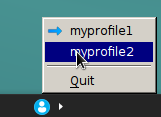

# git-profiles

System tray Git profile manager.

## Installation

### Sources

```
mkdir build
cd build
cmake ..
make
make install
```

### Debian package

```
debuild -us -uc -b
```

## Configuration

```
vi $HOME/.git-profiles
[myprofile1]
user.name = My Name
user.email = myname@example.com
core.editor = vi

[myprofile2]
user.name = My Name 2
user.email = myname2@example.com
core.editor = vi
```

## Running

`git-profiles`



## Known Issues

- System tray icon is invisible (this is a known issue in Qt 5)

## TODO

- More configuration options
- Use system icons and theme

## License

MIT
